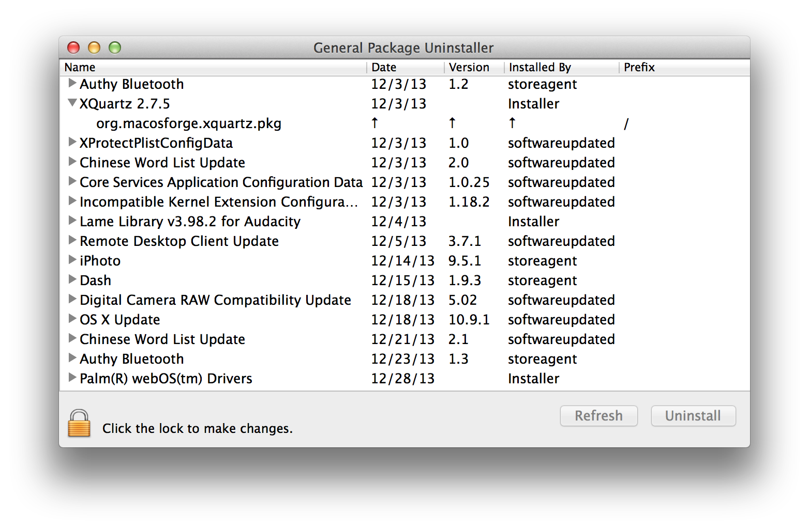

###Introduction

It's really annoying that Apps installed by pkg files don't provide a way to uninstall them. Package Uninstaller is kind of Proof of Concept to solve this problem. It will list all your installer receipts and you can uninstall them with just one click.

###Why not CleanMyMac/AppZapper...?

* for fun
* different focus, Package Uninstaller focus on apps installed by Apple Installer.

###ScreenShot

###Build

* Create a Self Signed Root/Code Signing named "Developer ID Application: In House Only" from KeyChain Acess.app
* Update your codesign certificate if you have enrolled Mac Developer Program:
* * key `SMPrivilegedExecutables` in `PackageUninstallerApp-Info.plist`
* * key `SMAuthorizedClients` in `PackageUninstallerHelper-Info.plist`

###TODO

* hook Apple Installer to support uninstall apps like MS Office.
* * pkg files are abused in MS Office.
* * Please go [How to completely remove Office for Mac 2011](http://support.microsoft.com/kb/2398768) for help, :)

###Credit
* Icon designed by Nikolay Verin - [http://ncrow.deviantart.com/](http://ncrow.deviantart.com/)
* launchctl from [opensource.apple.com](http://www.opensource.apple.com/source/launchd/launchd-442.26.2/)

###License

The MIT License (MIT)